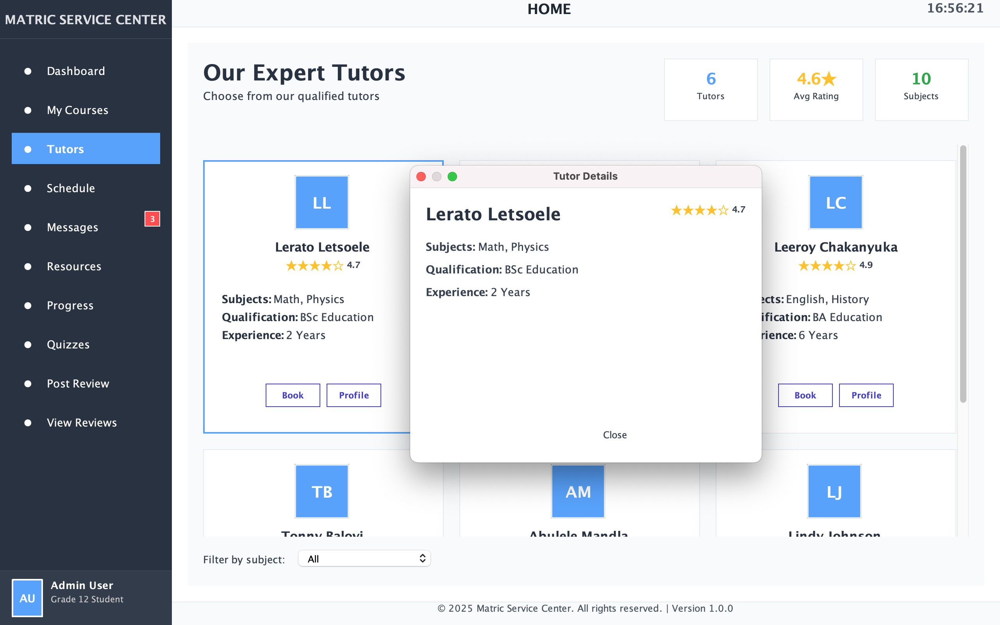

## Final-Year ICT Student | Aspiring Data Analyst

### Technical Skills: MySQL,Java,Excel,Power BI

##  About Me

I am a final-year Information and Communications Technology student at Cape Peninsula University of Technology with a strong focus on data analysis, databases, and software development.

I specialize in transforming raw data into meaningful insights using tools such as Excel, SQL and Power BI. Through academic and project-based experience, I have developed practical skills in data cleaning, database design, and data visualization.

I have worked on real-world inspired projects including healthcare patient data analysis, a student management system, and a collaborative learning platform where I contributed to tutor profile functionality.

I am actively seeking an opportunity in a Data Analyst or Junior Data role where I can apply my analytical thinking, technical skills, and problem-solving ability in a real business environment.

---

## Projects

## COVID-19 Hospital Data Analysis (Excel Project)

**Tools Used:** Microsoft Excel, Pivot Tables, Charts, Data Cleaning 

## Dashboard Preview 

**GitHub Repository:**  https://github.com/Leratoletsoele/Covid19-data-analysis-excel

This project involved analyzing a large dataset of hospital patient records affected by COVID-19.

### Responsibilities:
- Cleaned and structured raw patient data including age, severity, oxygen levels, ICU status, and comorbidities  
- Performed exploratory data analysis using Excel Pivot Tables  
- Created visualizations to identify patterns in patient outcomes  

### Key Insights:
- Patients with severe and critical conditions had higher ICU admission rates  
- Comorbidities such as diabetes and heart disease influenced recovery outcomes  
- Differences in recovery rates were observed across provinces  

**Outcome:**  
This project strengthened my ability to analyze healthcare datasets and extract meaningful insights to support data-driven conclusions.

---

##  Student Management System (Java + MySQL + JDBC)

**Tools Used:** Java, MySQL, JDBC  

## System Preview 

**GitHub Repository:**  https://github.com/Leratoletsoele/StudentEnrollmentSystem

This project involved the development of a database driven application for managing student records.

### Responsibilities:
- Designed and implemented a relational database using MySQL  
- Developed a Java application connected to the database using JDBC  
- Implemented full CRUD functionality (Create, Read, Update, Delete)  

### Key Features:
- Add new student records  
- Update existing student information  
- Retrieve student data from the database  
- Delete records securely  

**Outcome:**  
This project improved my understanding of backend development, database integration, and object-oriented programming principles.

---

##  Matric Service Center (roup Project)

**Tools Used:** Java, System Design, Collaborative Development

## Matric Service Center Preview 

This was a group project aimed at developing a learning platform for matric learners to access educational resources.

### My Contribution:
- Developed the Tutor Profile Page

### Responsibilities:
- Designed functionality to display tutor profiles  
- Enabled booking functionality for students  
- Displayed tutor subjects, availability, and reviews  

**Outcome:**  
This project improved my teamwork, communication, and system design skills while working in a collaborative environment.

## Reflection on Coding in Markdown using STAR Method

**Situation:**  
As part of developing my digital portfolio, I was required to use Markdown within GitHub to structure and present my CV, projects, and supporting evidence in a clear and professional format.

**Task:**  
My task was to learn and apply Markdown syntax effectively in order to organise my portfolio content in a way that is both visually appealing and easy to navigate, while maintaining a professional standard suitable for potential employers.

**Action:**  
I explored Markdown documentation and practiced using various formatting elements such as headings, lists, hyperlinks, and embedded media. I applied these techniques to structure my portfolio into clear sections, ensuring consistency and readability throughout. I also focused on presenting my projects and skills in a logical flow, making it easier for viewers to understand my experience and capabilities.

**Result:**  
Through this process, I developed a strong understanding of Markdown as a tool for technical communication. I improved my ability to present information in a structured and professional manner, which is an essential skill in the ICT field. This experience has also prepared me to use Markdown in real-world environments such as GitHub documentation, project repositories, and collaborative development work.

---

## Education

## Cape Peninsula University of Technology  
Diploma in Information and Communications Technology (Final Year)  
2024 – 2026  

## Chief Charles Secondary School  
National Senior Certificate  
Completed: 2022  

---

## Watch My Mock Interview Video

---

<video width="480" height="270" controls>
  <source src="Video.mp4" type="video/mp4">
</video>

---

## Reflection on Mock Interview using  STAR Method

**Situation:**  
As part of the Work Readiness programme, I participated in a mock interview designed to simulate a real-world recruitment process for a Data Analyst or entry-level ICT role. The purpose was to assess my ability to present myself professionally and apply my knowledge in an interview setting.

**Task:**  
My responsibility was to demonstrate my technical competencies, effectively communicate my academic and project experience, and respond to interview questions in a structured, confident, and professional manner.

**Action:**  
To prepare, I researched common interview questions and practiced structuring my responses using clear and logical explanations. I focused on aligning my answers with my practical experience, particularly my projects in data analysis, Java development, and database management. During the interview, I maintained professionalism by communicating clearly, staying composed, and ensuring that my responses were relevant and supported by real examples. I also made a conscious effort to highlight my problem-solving abilities and my understanding of data-driven decision-making.

**Result:**  
The mock interview was a valuable learning experience that enhanced both my communication and self-presentation skills. It helped me recognise the importance of structuring responses and confidently linking theoretical knowledge to practical application. I identified areas for improvement, such as refining the clarity and conciseness of my answers under pressure. Overall, the experience increased my confidence and better prepared me for real-world interviews, equipping me with the ability to present myself as a competent and work-ready candidate.

---

## Reflection on GitHub Pages using STAR Method

**Situation:**  
As part of the digital portfolio project, I was required to publish my GitHub repository using GitHub Pages to create a live, accessible website showcasing my work.

**Task:**  
My task was to deploy my portfolio professionally, ensuring that all content, including my CV, projects, and embedded media, was correctly displayed and accessible through a public link.

**Action:**  
I configured my GitHub repository by enabling GitHub Pages and selecting the appropriate branch for deployment. I ensured that my Markdown files were properly structured and compatible with web viewing. I also tested the live site to verify that all sections, links, and media elements functioned correctly and that the layout remained clean and readable.

**Result:**  
I successfully deployed my portfolio as a live website, making it easily accessible to lecturers and potential employers. This experience enhanced my understanding of web deployment and version control using GitHub. It also provided me with a professional platform to showcase my skills and projects, increasing my readiness for real-world industry expectations.

---

## Contact Information

- **Email:** 222381582@mycput.ac.za  
- **Phone:** 066 103 5462  
 
---
## References

**Miss Nkosi**  
Former Mathematics Teacher - Chief Charles  
Email: nkosi.thulih@gmail.com  
Phone: 072 847 1319

